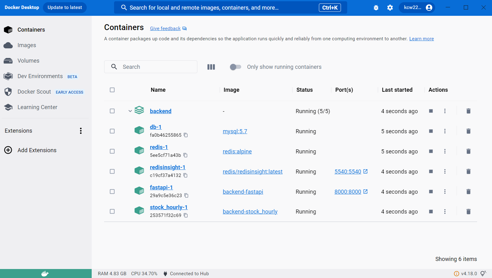
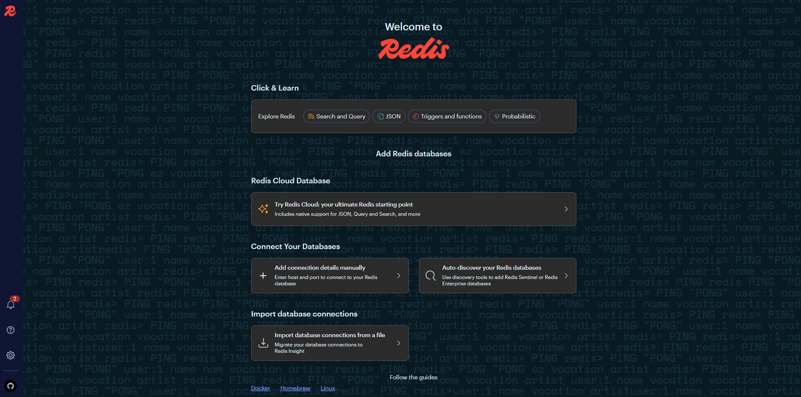
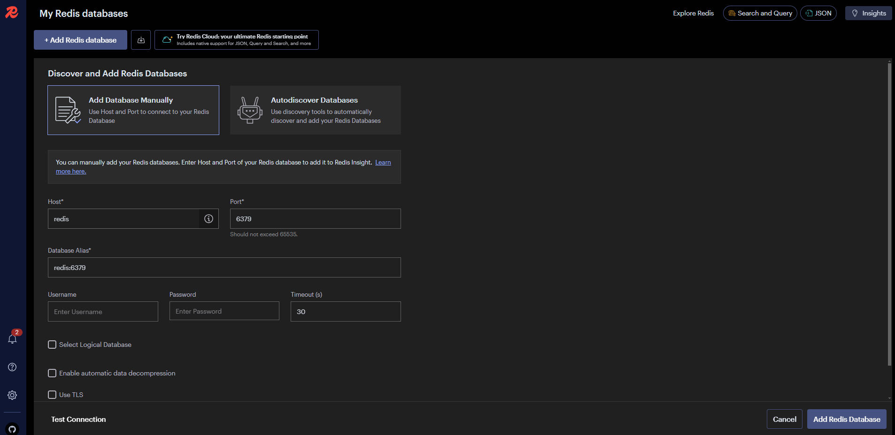
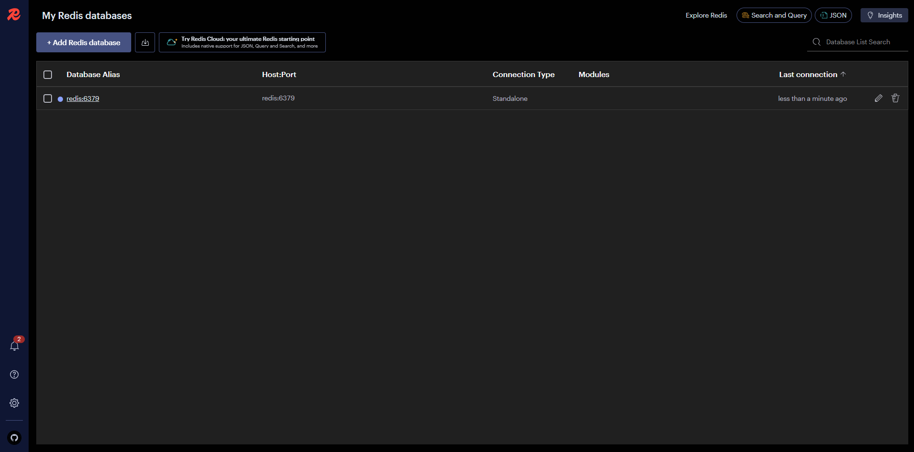
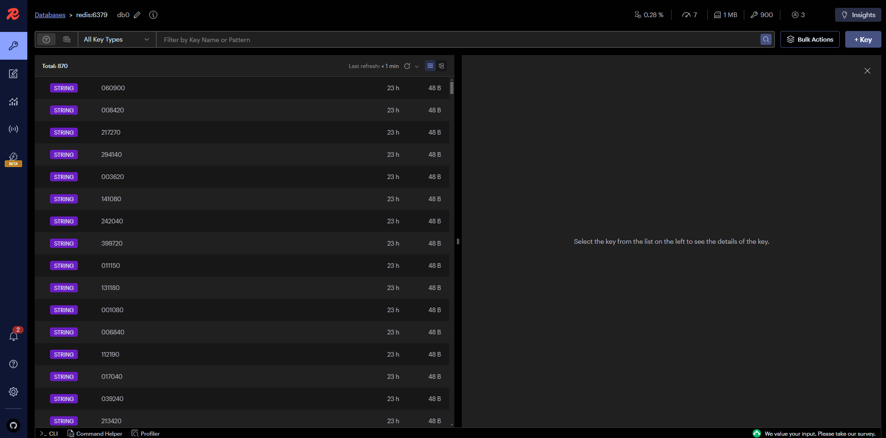

## 실행 방법
### Backend
1. backend 폴더 안에 .env 파일을 추가합니다.
2. make up을 실행합니다.
3. Api 명세서는 다음 링크에서 확인합니다 : http://localhost:8000/docs
4. 데이터 수집 현황은 아래 이미지를 참고하십시오:

- Docker containers : db, redis, redisinsight, fastapi가 정상 실행되는지 확인합니다.
- 정상적으로 실행되지 않다면 .env파일을 확인해서 db 경로가 올바로 되어 있는지 확인합니다.

- redis 데이터가 자동으로 수집 됩니다.
- Add connection details manually를 눌러 redis와 연결합니다.

- Host 명을 redis로 변경합니다.
- Database Alias는 redis:6379로 변경합니다.

- 연결된 데이터베이스를 클릭합니다.

- stock_code : stock_price 형태로 저장되어 있는걸 확인합니다.

### Frontend
1. cd /assetmanagement/frontend
2. sudo npm i
3. sudo npm run dev

