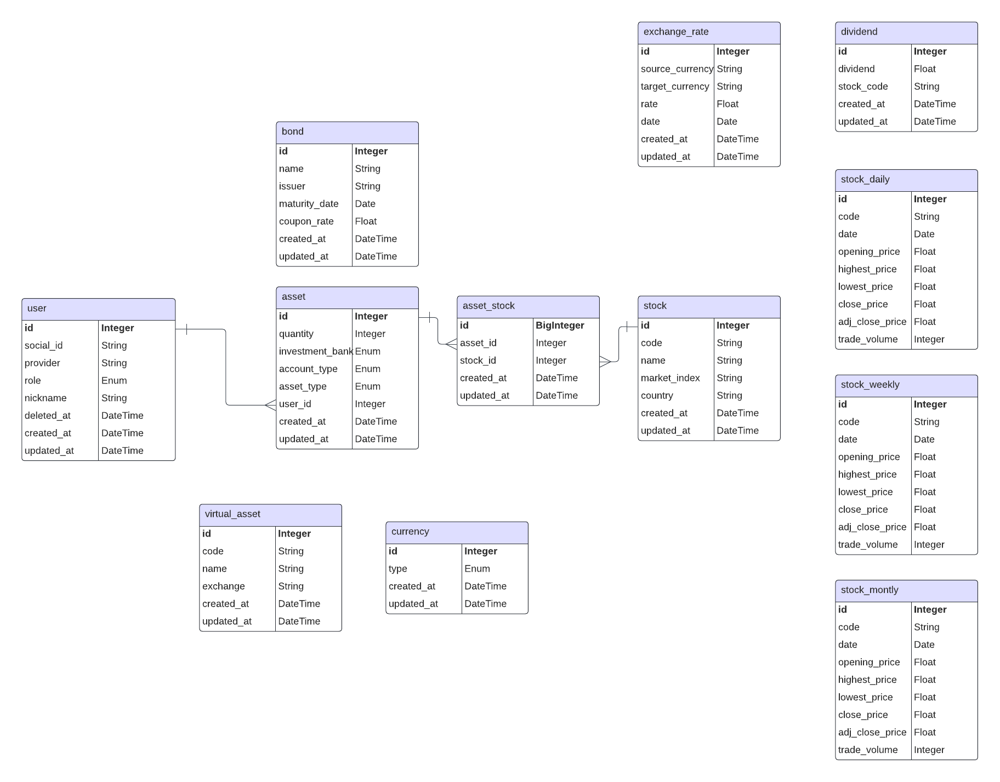
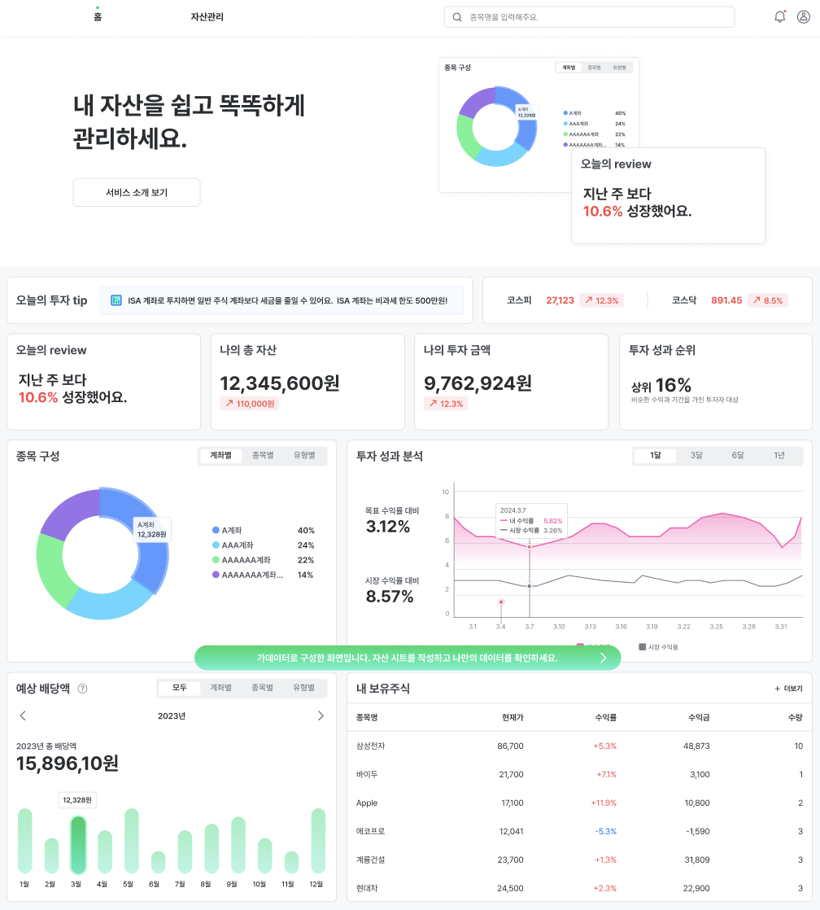

# 개미스쿨

## 목차
1. [프로젝트 개요](#프로젝트-개요)
2. [API 명세서](#api-명세서)
3. [ERD](#erd)
4. [DESIGN](#design)

## 프로젝트 개요
제작 기간 : 2024.02.24 ~ 진행중  
팀원 : 3명  

- 이송희 : (Frontend)
- 김채욱 : (Backend)
- 정다혜 : (Design)

> "노후 빈곤율 1위를 해결하기 위해 자산 관리 서비스를 기획하게 되었습니다. 주변 10명 이상의 지인들에게 재테크 현황을 물어본 결과, 제대로 자산 관리를 하고 있는 사람은 1명에 불과하다는 사실을 알게 되었습니다. 효과적인 자산 관리는 개인의 재정적 안정성을 높여주어, 미래에 노후 빈곤 문제를 해결하는 데 중요한 역할을 할 수 있습니다. 이러한 문제를 해결하기 위해, 누구나 쉽게 재테크를 시작할 수 있도록 진입 장벽을 낮추는 프로젝트를 시작하게 되었습니다”  

## API 명세서
http://www.gaemischool.com:8000/docs

## ERD

## DESIGN

